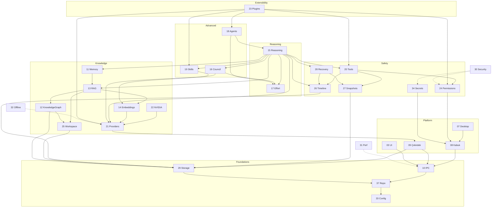
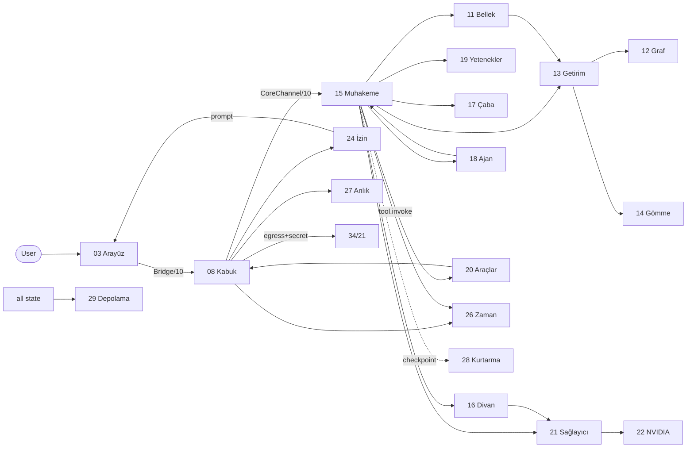

# Architecture Index — The Map of the Bible (Mimari Dizin)

> The master index of the **turkish.code Engineering Bible**. Start here.
> **Status:** Canonical · **Version:** 2.0 · **Last updated:** 2026-07-12
> **Purpose:** Catalog every document, show how the subsystems depend on and relate to each other, and give a new implementer (human or AI) a single onboarding entry point.
> **v2.0 note** (per [52_ADR_LOG](./52_ADR_LOG.md)): the provider/LLM layer was audited against the recovered `PROJECT_ANALYSIS.md` and corrected to **cloud-primary, model-first** (Gemini/Groq/OpenRouter/NVIDIA NIM + Ollama fallback), **light privacy/keys**, with new docs **45–52**. Read [52_ADR_LOG](./52_ADR_LOG.md) for the chronological decision history.

---

## 0. How To Use This Index

- **New here?** Read the **AI/Developer Onboarding Guide** (§7) — it tells you exactly what to read, in order.
- **Looking for a subsystem?** Use the **Document Catalog** (§1).
- **Building it?** Use the **Dependency Graph** (§3) + **Implementation Order** (§5) + **Milestones** (§6).
- **Need a term?** [44_GLOSSARY](./44_GLOSSARY.md). **A rule?** [02_DESIGN_PRINCIPLES](./02_DESIGN_PRINCIPLES.md). **The process?** [41_IMPLEMENTATION_RULES](./41_IMPLEMENTATION_RULES.md).

This index is navigation + synthesis; the **authoritative content lives in each numbered doc** ([40_DOCUMENTATION_RULES](./40_DOCUMENTATION_RULES.md): single source of truth). Where this index summarizes (order, priority, milestones), the owning doc ([42_ROADMAP](./42_ROADMAP.md)) is authoritative.

---

## 1. Document Catalog

| # | Doc | Turkish | Owns | Tier |
|---|---|---|---|---|
| 00 | [Project Vision](./00_PROJECT_VISION.md) | Proje Vizyonu | pillars, success, personas | meta |
| 01 | [Architecture](./01_ARCHITECTURE.md) | Mimari | 3-tier model, invariants, lifecycle | meta |
| 02 | [Design Principles](./02_DESIGN_PRINCIPLES.md) | Tasarım İlkeleri | engineering rules PR-1..18 | meta |
| 03 | [UI System](./03_UI_SYSTEM.md) | Arayüz Sistemi | frontend arch, state, i18n | Arayüz |
| 04 | [Turkish Design Language](./04_TURKISH_DESIGN_LANGUAGE.md) | Türk Tasarım Dili | tokens, palette, type, motifs | Arayüz |
| 05 | [Animation System](./05_ANIMATION_SYSTEM.md) | Hareket Sistemi | motion tokens, streaming motion | Arayüz |
| 06 | [Component Library](./06_COMPONENT_LIBRARY.md) | Bileşen Kütüphanesi | components, product ("zeki") comps | Arayüz |
| 07 | [Desktop Architecture](./07_DESKTOP_ARCHITECTURE.md) | Masaüstü Mimarisi | packaging, OS, on-disk layout | Kabuk/platform |
| 08 | [Tauri/Shell](./08_TAURI_ARCHITECTURE.md) | Kabuk Mimarisi | broker, supervisor, enforcement | Kabuk |
| 09 | [Python Backend](./09_PYTHON_BACKEND.md) | Çekirdek Mimarisi | sidecar, concurrency, DI | Çekirdek |
| 10 | [IPC](./10_IPC.md) | — | Bridge + Core Channel contracts | seam |
| 11 | [Memory System](./11_MEMORY_SYSTEM.md) | Bellek | layered durable memory | Çekirdek |
| 12 | [Knowledge Graph](./12_KNOWLEDGE_GRAPH.md) | Bilgi Grafı | entities/relations, extraction | Çekirdek |
| 13 | [RAG System](./13_RAG_SYSTEM.md) | Getirim | hybrid retrieval, assembly | Çekirdek |
| 14 | [Embeddings](./14_EMBEDDINGS.md) | Gömme | embed/rerank, versioning | Çekirdek |
| 15 | [Reasoning Engine](./15_REASONING_ENGINE.md) | Muhakeme | plan→act→observe→reflect, trace | Çekirdek |
| 16 | [Council Mode](./16_COUNCIL_MODE.md) | Divan | multi-persona deliberation | Çekirdek |
| 17 | [Effort Modes](./17_EFFORT_MODES.md) | Çaba Modları | budgets (the compute dial) | Çekirdek |
| 18 | [Agent System](./18_AGENT_SYSTEM.md) | Ajanlar | orchestrator + sub-agents | Çekirdek |
| 19 | [Skills System](./19_SKILLS_SYSTEM.md) | Yetenekler | progressive-disclosure know-how | Çekirdek |
| 20 | [Tool System](./20_TOOL_SYSTEM.md) | Araçlar | executable capabilities | Çekirdek+Kabuk |
| 21 | [Provider System](./21_PROVIDER_SYSTEM.md) | Sağlayıcılar | provider-independent, **model-first** | Çekirdek |
| 22 | [Provider Integrations](./22_PROVIDER_INTEGRATIONS.md) | Sağlayıcı Entegrasyonları | Gemini/Groq/OpenRouter/NVIDIA NIM + Ollama | Çekirdek |
| 23 | [Plugin System](./23_PLUGIN_SYSTEM.md) | Eklentiler | sandboxed extensions | Çekirdek+Kabuk |
| 24 | [Permission System](./24_PERMISSION_SYSTEM.md) | İzinler | capability model + enforcement | Kabuk |
| 25 | [Workspace System](./25_WORKSPACE_SYSTEM.md) | Çalışma Alanı | project scope + isolation | Çekirdek |
| 26 | [Timeline](./26_TIMELINE.md) | Zaman Çizelgesi | append-only event log | Çekirdek |
| 27 | [Snapshots](./27_SNAPSHOTS.md) | Anlık Görüntüler | content-addressed undo | Çekirdek+Kabuk |
| 28 | [Crash Recovery](./28_CRASH_RECOVERY.md) | Kurtarma | checkpoints + resume | Çekirdek+Kabuk |
| 29 | [Storage](./29_STORAGE.md) | Depolama | SQLite/vec/CAS/journal | Çekirdek |
| 30 | [Security](./30_SECURITY.md) | Güvenlik | threat model + invariants | cross-cutting |
| 31 | [Performance](./31_PERFORMANCE.md) | Başarım | budgets, degradation, measurement | cross-cutting |
| 32 | [Offline Fallback](./32_OFFLINE_FIRST.md) | Çevrimdışı Yedek | Ollama local fallback (resilience) | cross-cutting |
| 33 | [Configuration](./33_CONFIGURATION.md) | Yapılandırma | layered config resolution | cross-cutting |
| 34 | [API Keys](./34_API_KEYS.md) | API Anahtarları | light key handling (keys out of source) | cross-cutting |
| 35 | [Testing](./35_TESTING.md) | Test Stratejisi | pyramid + pillar gates | cross-cutting |
| 36 | [Coding Standards](./36_CODING_STANDARDS.md) | Kodlama Standartları | per-language code rules | cross-cutting |
| 37 | [Repository Structure](./37_REPOSITORY_STRUCTURE.md) | Depo Yapısı | monorepo layout + tooling | cross-cutting |
| 38 | [Error Handling](./38_ERROR_HANDLING.md) | Hata Yönetimi | typed error taxonomy | cross-cutting |
| 39 | [Logging](./39_LOGGING.md) | Günlükleme | structured local logs | cross-cutting |
| 40 | [Documentation Rules](./40_DOCUMENTATION_RULES.md) | Dokümantasyon Kuralları | how the Bible is written | meta |
| 41 | [Implementation Rules](./41_IMPLEMENTATION_RULES.md) | Uygulama Kuralları | build workflow + gates | meta |
| 42 | [Roadmap](./42_ROADMAP.md) | Yol Haritası | phases/order/priority/milestones | meta |
| 43 | [Non-Goals](./43_NON_GOALS.md) | Hedef Olmayanlar | deliberate exclusions | meta |
| 44 | [Glossary](./44_GLOSSARY.md) | Sözlük | canonical terminology | meta |
| 45 | [Routing & Orchestration](./45_ROUTING_ORCHESTRATION.md) | Yönlendirme | **model-first router**, failover/cooldown | Çekirdek |
| 46 | [Capability Taxonomy](./46_CAPABILITY_TAXONOMY.md) | Yetenek Taksonomisi | model-capability vocabulary | Çekirdek |
| 47 | [Scoring Algorithms](./47_SCORING_ALGORITHMS.md) | Puanlama | provider + model scoring | Çekirdek |
| 48 | [Quota & Tier Mgmt](./48_QUOTA_TIER_MANAGEMENT.md) | Kota ve Kademe | quota-preserving routing, cooldown | Çekirdek |
| 49 | [Model Cache](./49_MODEL_CACHE.md) | Model Önbelleği | 24h model catalog cache | Çekirdek |
| 50 | [Benchmark & Speed Test](./50_BENCHMARK_SPEEDTEST.md) | Kıyaslama | latency/quality probes, profiles | Çekirdek+Arayüz |
| 51 | [Metrics](./51_METRICS.md) | Metrikler | local observability catalog | Çekirdek |
| 52 | [ADR Log](./52_ADR_LOG.md) | Karar Günlüğü | decision history + rejected ideas (chronological) | meta |
| — | [AGENTS.md](./AGENTS.md) | Ajan Rehberi | agent authoring + AI operator contract | meta |
| — | [SKILLS.md](./SKILLS.md) | Yetenek Rehberi | skill authoring guide | meta |

---

## 2. The System at a Glance (Tiers)

```
┌──────────────────────────────────────────────────────────────────────────┐
│ ARAYÜZ (Frontend, untrusted)   03 UI · 04 TTD · 05 Motion · 06 Components  │
│        │  Bridge (Tauri commands/events) — 10 IPC                          │
│ KABUK  ▼ (Shell, trusted broker)  07 Desktop · 08 Tauri · 24 Permissions · │
│        │  34 Secrets · broker(fs/shell/net) · supervisor                   │
│        │  Core Channel (JSON-RPC/stdio, no port) — 10 IPC                   │
│ ÇEKİRDEK▼ (Core, AI brain)  09 Python                                       │
│    Muhakeme 15 ─ Divan 16 ─ Çaba 17 ─ Ajanlar 18 ─ Yetenekler 19 ─ Araçlar 20│
│    Bellek 11 ─ Bilgi Grafı 12 ─ Getirim 13 ─ Gömme 14                        │
│    Sağlayıcılar 21 (+ NVIDIA 22) ─ Çalışma Alanı 25                          │
│    Zaman 26 ─ Anlık 27 ─ Kurtarma 28 ─ Depolama 29                           │
│ Cross-cutting: 30 Security · 31 Perf · 32 Offline · 33 Config · 35 Test ·   │
│                36 Coding · 37 Repo · 38 Errors · 39 Logging                  │
└──────────────────────────────────────────────────────────────────────────┘
Meta/governance: 00 Vision · 01 Architecture · 02 Principles · 40 Doc rules ·
                 41 Impl rules · 42 Roadmap · 43 Non-goals · 44 Glossary ·
                 AGENTS · SKILLS
```

---

## 3. Dependency Diagram (Build-Order Dependencies)

"A → B" = A depends on B (B must exist/work first). Foundations at the bottom.



**ASCII summary of layers (bottom = build first):**
```
L0 Foundations:  37 Repo · 33 Config · 10 IPC · 29 Storage
L1 Platform:     07 Desktop · 08 Kabuk · 09 Çekirdek · 03 UI
L2 Safety:       24 Permissions · 20 Tools · 27 Snapshots · 26 Timeline · 34 Secrets · 28 Recovery
L3 Knowledge:    21 Providers(+22) · 14 Embeddings · 25 Workspace · 12 Graph · 13 RAG · 11 Memory
L4 Reasoning:    17 Effort · 15 Reasoning
L5 Advanced:     19 Skills · 16 Council · 18 Agents
L6 Extend/Polish:23 Plugins · 04/05/06 Design · cloud providers
Cross-cutting (all layers): 30 Security · 31 Perf · 32 Offline · 35 Test · 36 Coding · 38 Errors · 39 Logging
```

---

## 4. Subsystem Relationship Diagram (Runtime Data Flow)

How subsystems *talk at runtime* during a request (not build-order). See [01_ARCHITECTURE](./01_ARCHITECTURE.md) §8 for the canonical lifecycle.



**The three structural guarantees visible in this flow:**
1. **Every side effect** routes `Muhakeme → Araçlar(20) → Kabuk → İzin(24)` — permission is unavoidable ([P5]).
2. **Every mutation** triggers `Kabuk → Anlık(27)` before writing — reversible ([P4]).
3. **Everything** appends to `Zaman(26)` — audited ([P4]); egress only via `Kabuk → 34/21` with consent ([P1]).

---

## 5. Implementation Order (Summary — authoritative: [42_ROADMAP](./42_ROADMAP.md) §4)

```
1. Foundations:  37 → 33 → 10 (contracts) → 29 (storage) → walking skeleton (08+09+03+07)
2. Safety:       24 → 20 (+27, +26 hooks) → 34 → 28 (checkpoints)
3. Knowledge:    21 (+22 local) → 14 → 25 → 12 + 13 → 11
4. Reasoning:    17 → 15
5. Advanced:     19 → 16 → 18
6. Extend/Polish:23 → cloud providers → full 04/05/06 design
7. Hardening/GA: 31 perf → 30 security audit → 32 offline gate → locale gate → packaging (07)
```
**Sequencing rules:** contracts before code; offline/local before cloud; safety hooks *with* the feature; a dependent never precedes its dependency ([41_IMPLEMENTATION_RULES](./41_IMPLEMENTATION_RULES.md) §7, [42_ROADMAP](./42_ROADMAP.md) §7).

---

## 6. Priority & Milestones (Summary — authoritative: [42_ROADMAP](./42_ROADMAP.md) §5–6)

**Priority tiers:** `P0` structural safety substrate (tiers/IPC/storage/journal/permission/snapshots/timeline/secrets) → `P1` core value (local provider, RAG, graph, memory, effort, reasoning, basic UI) → `P2` differentiators (council, agents, skills, TTD polish, GPU) → `P3` extensibility (plugins, cloud) → `P4` futures (headless/remote/marketplace).

**Milestones:** M1 Walking Skeleton · M2 Safe Tooling · M3 Offline Reasoning · M4 Agentic Editing · M5 Advanced Intelligence · M6 Extensible & Beautiful · M7 GA — each accepted by its **pillar gates** ([35_TESTING](./35_TESTING.md) §6).

---

## 7. AI / Developer Onboarding Guide (Read In This Order)

**If you are about to build or extend turkish.code, read in this order** (this is the canonical onboarding path — [AGENTS.md](./AGENTS.md) §8 is the operator contract):

1. **[00_PROJECT_VISION](./00_PROJECT_VISION.md)** — the five pillars (P1 **multi-provider model-first intelligence + offline fallback**, P2 Turkish-native, P3 agentic, P4 memory/audit, P5 trustworthy). Everything serves these. See [52_ADR_LOG](./52_ADR_LOG.md) for why P1 changed.
2. **[44_GLOSSARY](./44_GLOSSARY.md)** — the canonical terms (Arayüz/Kabuk/Çekirdek, Muhakeme, Divan, Getirim, Bellek, …). Don't invent synonyms.
3. **[01_ARCHITECTURE](./01_ARCHITECTURE.md)** — the three-tier model, trust boundaries, and the canonical request lifecycle (§8). Internalize the three structural guarantees (this index §4).
4. **[02_DESIGN_PRINCIPLES](./02_DESIGN_PRINCIPLES.md)** — PR-1..18 and the decision priority order (§4). These resolve any ambiguity.
5. **[41_IMPLEMENTATION_RULES](./41_IMPLEMENTATION_RULES.md)** + **[40_DOCUMENTATION_RULES](./40_DOCUMENTATION_RULES.md)** — the workflow, the Definition of Done, and how to keep docs in sync.
6. **[35_TESTING](./35_TESTING.md) §6** — the pillar gates you must not break.
7. **[36_CODING_STANDARDS](./36_CODING_STANDARDS.md)** + **[37_REPOSITORY_STRUCTURE](./37_REPOSITORY_STRUCTURE.md)** — how/where to write code.
8. **The owning doc** of whatever subsystem you're touching (this index §1) — plus its direct dependencies (§3).
9. **[42_ROADMAP](./42_ROADMAP.md)** — where your work fits in the sequence.

**The five things to never do** (condensed from every "Must Never Happen" section; full list [30_SECURITY](./30_SECURITY.md) §12):
1. A side effect (fs/shell/egress) without passing the permission engine ([24](./24_PERMISSION_SYSTEM.md)).
2. A file mutation without a prior snapshot ([27](./27_SNAPSHOTS.md)).
3. A secret anywhere but the OS keychain ([34](./34_API_KEYS.md)).
4. A core feature that requires the network ([32](./32_OFFLINE_FIRST.md)).
5. An unbounded loop/recursion/agent-fan-out ([17](./17_EFFORT_MODES.md)/[14 PR-14]).

**The one workflow** (every change): design → **contract first** ([10](./10_IPC.md)) → implement ([36](./36_CODING_STANDARDS.md), side effects via broker) → test + **gate tests** ([35](./35_TESTING.md)) → **update the doc** ([40](./40_DOCUMENTATION_RULES.md)) → verify gates → review. Done = gates pass + doc matches ([41](./41_IMPLEMENTATION_RULES.md) §6).

---

## 8. Coding Guidelines (Pointer)

Full rules: **[36_CODING_STANDARDS](./36_CODING_STANDARDS.md)** (per-language) + **[02_DESIGN_PRINCIPLES](./02_DESIGN_PRINCIPLES.md)** (why). The essentials: typed boundaries; explicit dependencies (DI, no globals); one path per side effect (broker only); typed errors, never silent; bounded everything; no hardcoded/mis-cased Turkish strings; nothing to Çekirdek stdout but protocol; token-only styling; cite the governing invariant in comments.

---

## 9. Cross-Reference Map (Hub Documents)

The most-referenced docs (change them → check dependents). Use this when editing an invariant to find impact ([40_DOCUMENTATION_RULES](./40_DOCUMENTATION_RULES.md) §8/§9).

| Hub doc | Referenced by (high-impact) |
|---|---|
| [01_ARCHITECTURE](./01_ARCHITECTURE.md) | ~all |
| [02_DESIGN_PRINCIPLES](./02_DESIGN_PRINCIPLES.md) | ~all (PR-1..18 cited everywhere) |
| [10_IPC](./10_IPC.md) | 03, 08, 09, 15, 20, 21, 24, 26, 28, 38 |
| [24_PERMISSION_SYSTEM](./24_PERMISSION_SYSTEM.md) | 08, 15, 18, 19, 20, 23, 27, 30, 34 |
| [27_SNAPSHOTS](./27_SNAPSHOTS.md) | 08, 15, 18, 20, 26, 28, 29 |
| [26_TIMELINE](./26_TIMELINE.md) | 08, 11, 15, 20, 24, 27, 28, 29 |
| [29_STORAGE](./29_STORAGE.md) | 11, 12, 13, 14, 25, 26, 27, 28, 34 |
| [17_EFFORT_MODES](./17_EFFORT_MODES.md) | 11, 13, 15, 16, 18, 21, 31 |
| [30_SECURITY](./30_SECURITY.md) | 08, 20, 21, 23, 24, 32, 34, 35, 39 |
| [21_PROVIDER_SYSTEM](./21_PROVIDER_SYSTEM.md) | 14, 15, 16, 22, 32, 34 |
| [44_GLOSSARY](./44_GLOSSARY.md) | ~all (terminology authority) |

---

## 10. Consistency Pass (Phase 1 Reconciliation Notes)

Per [40_DOCUMENTATION_RULES](./40_DOCUMENTATION_RULES.md) §9, contradictions/duplications were resolved so the Bible is coherent. Canonical decisions locked across all docs:

- **Terminology:** all subsystems use the Turkish canonical names + ASCII-transliterated identifiers ([44](./44_GLOSSARY.md) §2). Forbidden aliases (log≠Timeline; Snapshot=files vs Checkpoint=session-state; Skill vs Plugin; Divan vs "committee") are honored everywhere.
- **The egress/secret contract** is stated once in [08](./08_TAURI_ARCHITECTURE.md) §10 + [21](./21_PROVIDER_SYSTEM.md) §7 + [34](./34_API_KEYS.md); other docs link, not restate.
- **The security invariants** are gathered once in [30](./30_SECURITY.md) §12; other docs' "must never happen" lists are consistent with it and the [35](./35_TESTING.md) gates.
- **Snapshot-before-mutation** and **permission-at-broker** are asserted identically in [01](./01_ARCHITECTURE.md)/[08](./08_TAURI_ARCHITECTURE.md)/[20](./20_TOOL_SYSTEM.md)/[24](./24_PERMISSION_SYSTEM.md)/[27](./27_SNAPSHOTS.md).
- **Effort budget** is the single source of all limits ([17](./17_EFFORT_MODES.md)); every bounded subsystem reads its slice from there.
- **Offline-first** ([32](./32_OFFLINE_FIRST.md)) and **the pillar priority order** ([02](./02_DESIGN_PRINCIPLES.md) §4) are consistent across performance/provider/security trade-off discussions.
- **Process model:** one Çekirdek process, per-workspace isolation by default ([25](./25_WORKSPACE_SYSTEM.md) §7), referenced consistently by [01](./01_ARCHITECTURE.md)/[07](./07_DESKTOP_ARCHITECTURE.md)/[29](./29_STORAGE.md).

If a future contradiction is found, resolve it per [40_DOCUMENTATION_RULES](./40_DOCUMENTATION_RULES.md) §8 and update this section.

---

## 11. Status

**Phase 1 (Documentation) — COMPLETE.** All 46 subsystem/meta documents + this index are Canonical. The Bible is sufficient for an implementer (human or AI) to build turkish.code without further design decisions ([00_PROJECT_VISION](./00_PROJECT_VISION.md) §8 #5). Phase 2 (implementation) begins per [42_ROADMAP](./42_ROADMAP.md), following [41_IMPLEMENTATION_RULES](./41_IMPLEMENTATION_RULES.md).

> **Do not implement code as part of Phase 1.** The next action is to begin M1 (Walking Skeleton) under the roadmap and implementation rules — only when implementation is explicitly authorized.
